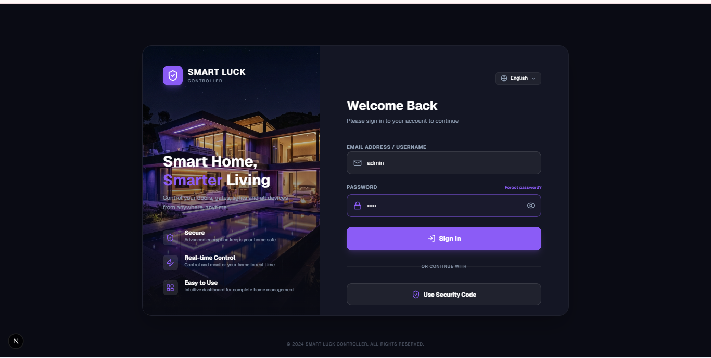
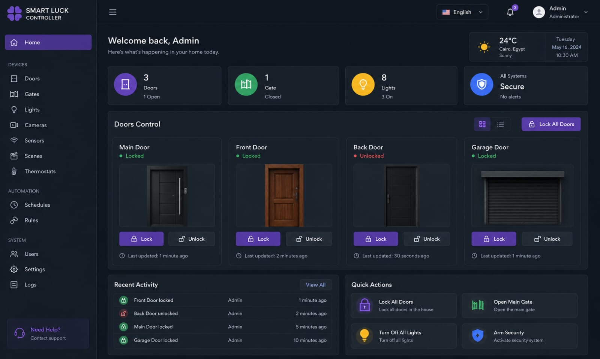
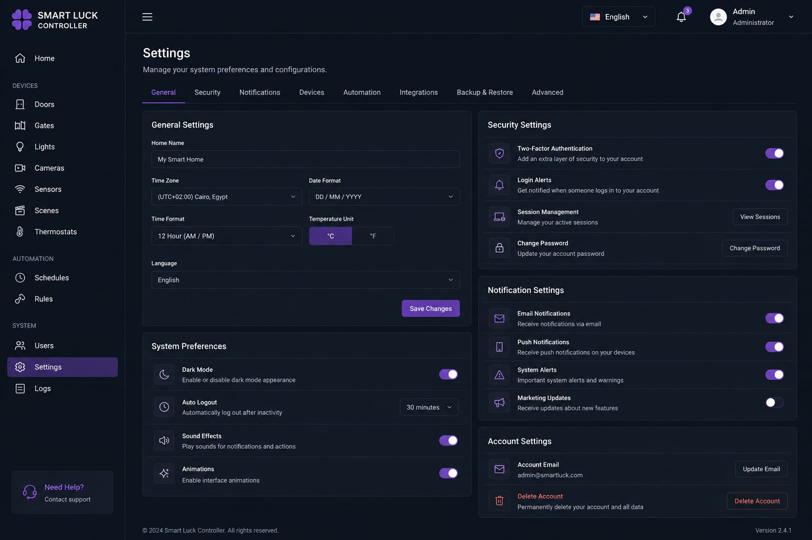

# 🔐 SecureLock IoT — Enterprise Smart Lock Simulation

[](https://github.com/Ma7moudMo7med/Smart-Lock-Simulation)
[]()
[]()
[]()

A professional-grade, vulnerable-by-design IoT Smart Lock simulation platform. This project is designed for **security research, education, and honeypot deployment** (ideally alongside T-Pot). It provides a realistic enterprise smart-home interface while simulating common IoT vulnerabilities to attract and study attacker behavior in a safe, containerized environment.

---

## 📖 Project Overview

SecureLock simulates a modern IoT ecosystem consisting of a management dashboard and a backend service that controls "smart locks." It mimics real-world device communication, firmware updates, and administrative controls. However, every vulnerability is a **safe simulation**: it records malicious intent without ever executing dangerous commands on the host system.

---

## 🖼 Screenshots

<div align="center">
  <p><b>🔐 Secure Login Portal - Enterprise Authentication</b></p>
  
  <br><br>
  <p><b>📊 Main Dashboard - Real-time IoT Control Center</b></p>
  
  <br><br>
  <p><b>⚙️ System Settings - Advanced Configuration Simulation</b></p>
  
</div>

---

## 🛠 Tech Stack & Tools

The project is built using modern, industry-standard technologies to ensure a realistic feel:

### 🎨 Frontend (The Control Center)

- **Framework:** Next.js 14 (App Router)
- **Language:** TypeScript
- **Styling:** Tailwind CSS (Modern Dark UI)
- **Icons:** Lucide React
- **Animations:** Framer Motion
- **State Management:** React Hooks & Context API

### ⚙️ Backend (The Logic Engine)

- **Framework:** ASP.NET Core 8 (Minimal APIs)
- **Security:** JWT Authentication
- **Documentation:** Swagger / OpenAPI
- **Logging:** Structured JSON logging (ELK-ready)
- **Data:** In-memory store (volatile for honeypot safety)

### 🐳 Infrastructure

- **Containerization:** Docker
- **Orchestration:** Docker Compose
- **Network:** Isolated Bridge Network (`smartlock-net`)

---

## 🏗 System Layers & Architecture

The project is architected into three primary layers, each serving a specific role:

### 1. Presentation Layer (`frontend-app`)

This is the interface the "user" (or attacker) interacts with. It looks like a premium Smart Home dashboard.

- **Goal:** Provide a convincing target that encourages interaction.
- **Key Modules:** Login, Dashboard, Device Settings, System Logs, Firmware Update.

### 2. API & Simulation Layer (`smart-lock-service`)

The brain of the operation. It handles all requests and simulates the "hardware" responses.

- **Goal:** Execute business logic and simulate vulnerabilities (like command injection or user enumeration).
- **Key Modules:** Auth Controller, Device Service, Logging Service, Firmware Mock.

### 3. Infrastructure Layer (Docker)

Ensures the entire stack is portable and isolated.

- **Goal:** Prevent any simulated vulnerability from affecting the host machine.
- **Key Files:** `docker-compose.yml`, `Dockerfile` (per service).

---

## 🚀 Getting Started

### Prerequisites

Before you begin, ensure you have the following installed on your system:

- [Docker Desktop](https://www.docker.com/products/docker-desktop/) (Includes Docker Compose)
- [Node.js v18+](https://nodejs.org/) (Optional: Only for local dev without Docker)
- [.NET 8 SDK](https://dotnet.microsoft.com/download/dotnet/8.0) (Optional: Only for local dev without Docker)

### Installation & Deployment

Follow these commands in order to get the project up and running:

1. **Clone the Repository:**

   ```bash
   git clone https://github.com/Ma7moudMo7med/Smart-Lock-Simulation.git
   cd Smart-Lock-Simulation
   ```

2. **Setup Environment Variables:**
   Copy the example environment file:

   ```bash
   cp .env.example .env
   ```

3. **Build and Run (Docker Compose):**
   This is the recommended way to run the project.

   ```bash
   docker compose build
   docker compose up -d
   ```

4. **Verify the Services:**
   Check if containers are running:
   ```bash
   docker compose ps
   ```

---

### 🔑 Seeded Credentials (Intentional Weakness)

The following accounts are pre-configured to test different access levels:

| Username     | Password   | Role                       |
| :----------- | :--------- | :------------------------- |
| `admin`      | `admin123` | Full Administrative Access |
| `technician` | `tech123`  | Maintenance & Logs         |
| `guest`      | `guest`    | Limited View Only          |

---

---

## 📡 API Reference

The backend exposes several endpoints, some of which are intentionally vulnerable or provide sensitive information to simulate a poorly secured IoT device.

| Method | Path                   | Purpose                     | Vulnerability Simulation         |
| :----- | :--------------------- | :-------------------------- | :------------------------------- |
| `POST` | `/api/auth/login`      | User authentication         | Verbose errors, User enumeration |
| `GET`  | `/api/device/status`   | Current lock & sensor state | Information disclosure           |
| `POST` | `/api/device/lock`     | Lock the device             | Unauthorized access potential    |
| `GET`  | `/api/admin/logs`      | System logs                 | Exposed administrative route     |
| `POST` | `/api/firmware/update` | Firmware update simulation  | No signature verification        |
| `GET`  | `/api/export/config`   | Export system configuration | Plaintext secrets disclosure     |
| `GET`  | `/api/debug/system`    | System debug information    | Fake environment & shell leak    |

---

## 🛡 Simulated Vulnerabilities (Safe for Research)

Everything in this project is **simulated**. The container never executes actual attacker payloads; it only records the attempt and responds as a real vulnerable device would.

| Vulnerability Class        | Simulated Behavior                                                 | Goal for Researcher                           |
| :------------------------- | :----------------------------------------------------------------- | :-------------------------------------------- |
| **Weak Authentication**    | Uses common default passwords (`admin123`, `tech123`).             | Track brute-force & credential stuffing.      |
| **User Enumeration**       | Returns different errors for "Wrong Password" vs "User Not Found". | Identify account discovery attempts.          |
| **Information Disclosure** | `/api/export/config` returns secrets in plaintext.                 | Monitor for sensitive data exfiltration.      |
| **Command Injection**      | `/api/debug/system` echoes back shell commands.                    | Capture RCE (Remote Code Execution) payloads. |
| **Broken RBAC**            | Admin endpoints are reachable with low-privilege tokens.           | Track privilege escalation attempts.          |
| **Verbose Debugging**      | API returns stack traces and environment variables.                | Observe reconnaissance behavior.              |
| **Insecure Updates**       | Accepts any URL for firmware without validation.                   | Simulate malicious firmware delivery.         |
| **Sequential Sessions**    | Predictable session IDs in the backend.                            | Track session hijacking attempts.             |

---

## 📁 Project Structure

```text
Smart_Lock_Simulation/
├── docker-compose.yml           # Service orchestration
├── .env.example                 # Template for environment variables
├── frontend-app/                # Next.js Frontend
│   ├── src/app/                 # UI Routes
│   ├── src/components/          # UI Components
│   └── Dockerfile               # Frontend containerization
└── smart-lock-service/          # ASP.NET Core Backend
    ├── Endpoints/               # API Route Handlers
    ├── Models/                  # Data Structures
    ├── Services/                # Simulation Logic
    └── Dockerfile               # Backend containerization
```

---

## ⚠️ Disclaimer

This project is for **educational and research purposes only**. It is designed to be used in a controlled environment as a honeypot. The authors are not responsible for any misuse or damage caused by this software. Use it ethically.

---

## 🤝 Contributing

Contributions are welcome! If you have ideas for more simulated vulnerabilities or UI improvements, feel free to open a Pull Request.

---

Created with ❤️ for the Security Community.
